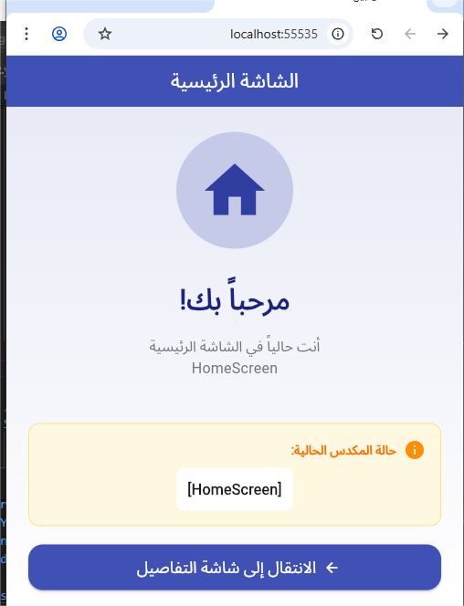

readme_final = """<div align="center">

# 🧭 التنقل بين الشاشات في فلاتر

[](https://flutter.dev)
[](LICENSE)

</div>

## 📸 لقطات الشاشة

| الشاشة الرئيسية | شاشة التفاصيل |
|:---:|:---:|
|  |  |

## 🎯 مكدس التنقل (LIFO)

```
[HomeScreen] ← push() ← [HomeScreen, DetailScreen] ← pop() ← [HomeScreen]
```

## 🚀 التشغيل

```bash
git clone https://github.com/odaifaez/MOBILE-APP-DEVELOPMENT_APP2_Basic-_Stack_-Navigation.git
cd MOBILE-APP-DEVELOPMENT_APP2_Basic-_Stack_-Navigation
flutter pub get && flutter run
```

## 💻 الكود

```dart
// ➡️ انتقال للأمام
Navigator.push(context, MaterialPageRoute(builder: (_) => DetailScreen()));

// ⬅️ رجوع
Navigator.pop(context);
```

## 🔄 العمليات

| العملية | الكود | المكدس |
|:---:|:---|:---:|
| push | `Navigator.push(context, route)` | `[A, B]` |
| pop | `Navigator.pop(context)` | `[A]` |
| pushReplacement | `Navigator.pushReplacement(context, route)` | `[B]` |

## ⚠️ خطأ شائع

```dart
// ❌ بدون context
Navigator.push(MaterialPageRoute(...));

// ✅ مع context
Navigator.push(context, MaterialPageRoute(...));
```

## 📝 الترخيص

MIT License - Copyright (c) 2026 odai faez
"""

with open('/mnt/agents/output/README.md', 'w', encoding='utf-8') as f:
    f.write(readme_final)

print("✅ تم إنشاء الملف!")
print("📁 المسار: /mnt/agents/output/README.md")
